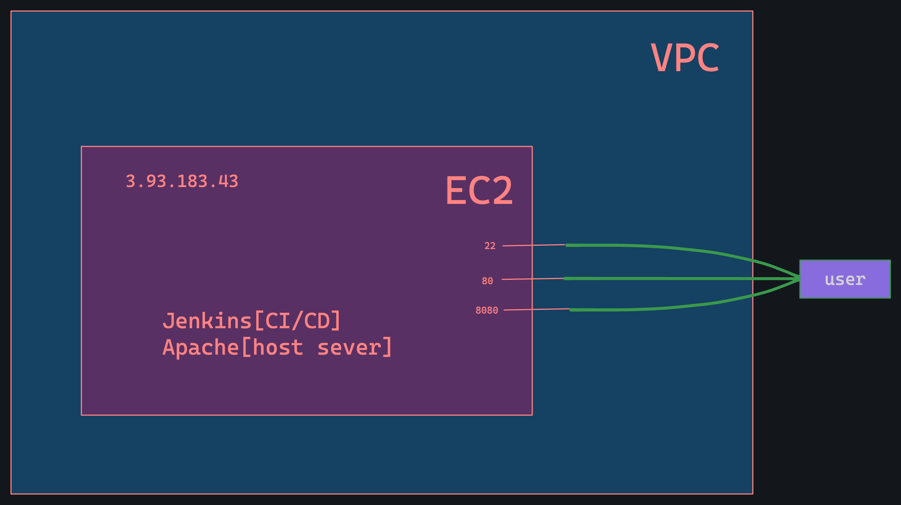

In this web application i try ci/cd pipelines with apache web server,github webhock, Amazon web Cloud (VPC,Ec2). For excess this application only open those port which are require.
Here the application is only frontend application. 

step 1: Goto cloud provider system here i am using aws for deploying my web application.

    

ip="the ip address"
http://ip:8080/github-webhook/

