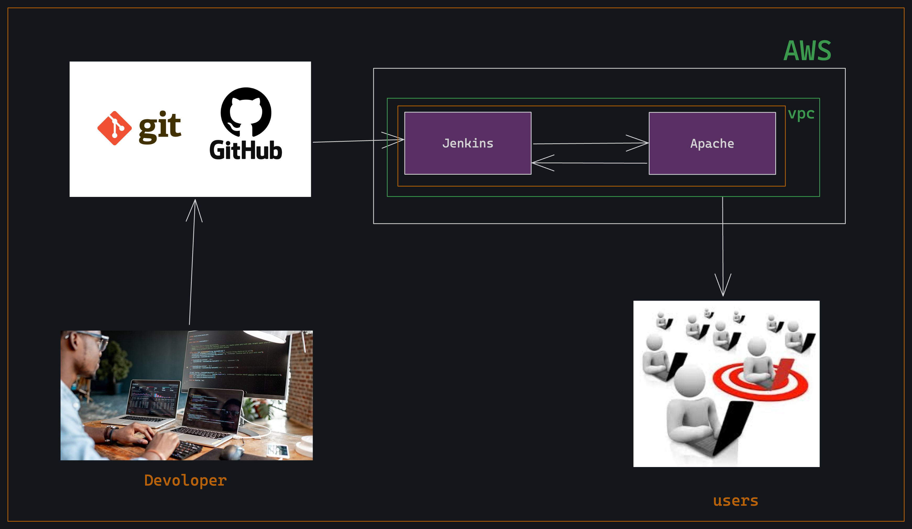

    

In this web application, I try ci/cd pipelines with Apache web server,github webhook, and Amazon web Cloud (VPC, Ec2). For excess, this application only opens those port that are required.
Here the application is only a frontend application. 

    

1. Goto cloud provider system here, i am using AWS for deploying my web application.
2. Create a vpc and create an Ec2 instance inside the vpc. Here I create an ec2 instance inside the default vpc.
3. Make ready the ec2 instance, Jenkins for ci/cd and Apache server deploying the website.[code right: code.sh] Here also set permission for the ci/cd pipeline.
4. Also keep in mind that we have to set inbound rules and open port for 8080 [jenkins] and 80[Apache webserver].
5. Configure the Jenkins tools and create a freestyle job.
6. Selected the document and write code [code right: jenkins]. In this code, the full source code is copied to Apache server.
7. In the github repository add the GitHub-webhook link and secrete code. http://"the ip address":8080/github-webhook/
8. Now, if we change anything in the code and run the git push command then we can see Jenkins build the project and we can see the updated view of the website 

https://youtu.be/Xy5pT0cJ7TA
