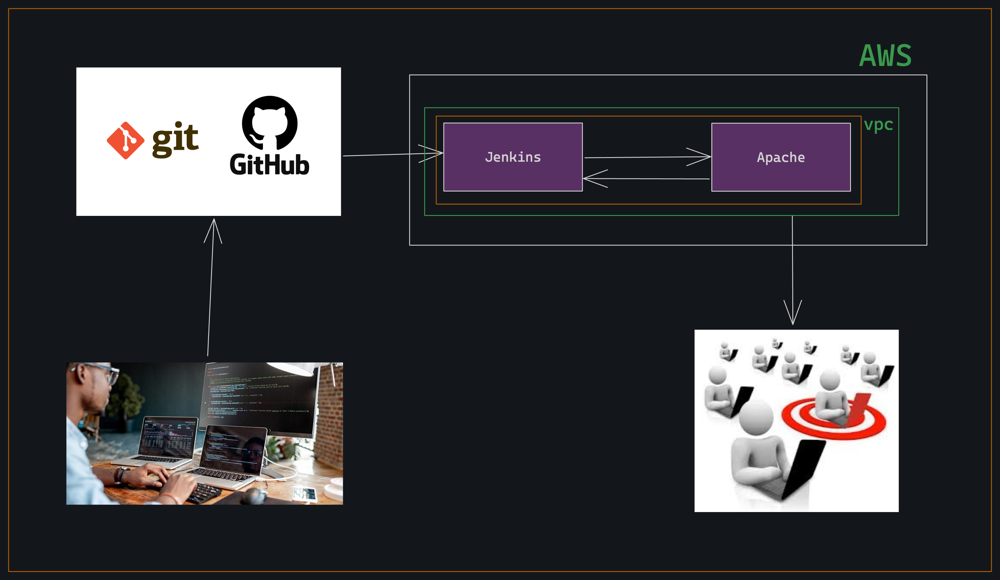

    

In this web application i try ci/cd pipelines with apache web server,github webhock, Amazon web Cloud (VPC,Ec2). For excess this application only open those port which are require.
Here the application is only frontend application. 

    

1. Goto cloud provider system here, i am using aws for deploying my web application.
2. Create a vpc as well as create an Ec2 instance insite the vpc.Here i create an ec2 instance insite default vpc.
3. Make ready the ec2 instance, jenkins for ci/cd and apache server deploying website.[code right: code.sh] Here also set permisson for ci/cd pipeline.
4. Also keep in mind that we have to set inbound rules and open port for 8080 [jenkins] and 80[Apache webserver].
5. Configure the jenkins tools and create free style job.
6. Selected the decoument and wirte code [code right: jenkins]. In this code the full source code copy to apache server.
7. In the github repratory add github-webhook link and also add screte code. http://"the ip address":8080/github-webhook/
8. Now, if we change any thing in code and run git push command then we can see jenkins build the project and we can see the update view of the website 

https://youtu.be/Xy5pT0cJ7TA
